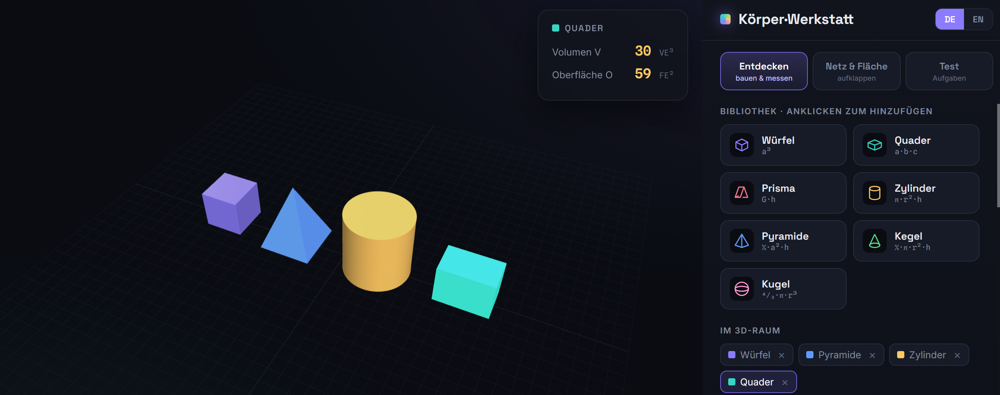
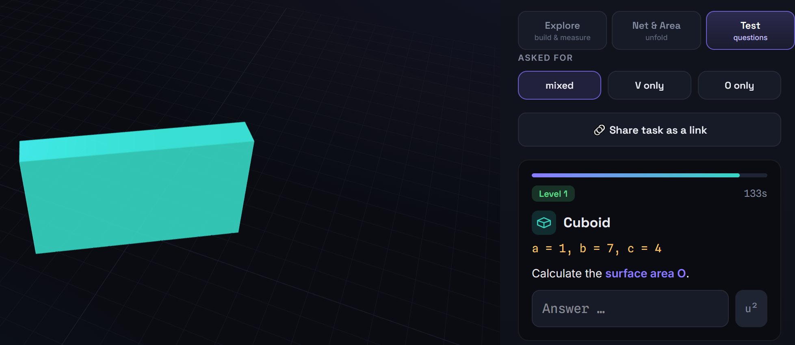
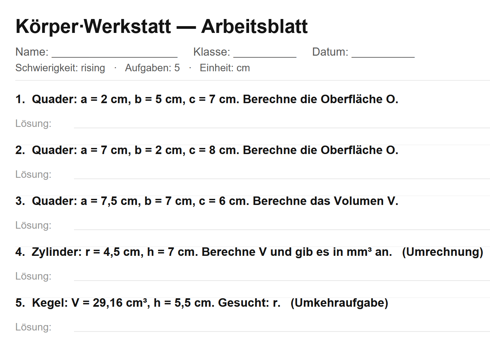

# Körper·Werkstatt 🧊 — 3D Body Workshop

> **EN:** It bundles the full loop — **explore → understand → practise → assess → hand out a worksheet** — into a single offline HTML file. No other free tool I'm aware of combines an interactive 3D builder, animated nets, a diagnostic quiz *and* a one-click worksheet generator with answer key in one place that also survives locked-down school networks.
>
> **DE:** Es bündelt den ganzen Kreislauf — **entdecken → verstehen → üben → prüfen → Arbeitsblatt austeilen** — in einer einzigen Offline-HTML-Datei. Kein anderes freies Tool, das ich kenne, vereint interaktiven 3D-Baukasten, animierte Netze, ein diagnostisches Quiz *und* einen Ein-Klick-Arbeitsblatt-Generator mit Lösungsblatt an einem Ort, der zudem in abgeschotteten Schulnetzen läuft.

**An interactive 3D learning tool for lower-secondary geometry — explore the volume and surface area of solids, unfold their nets, and practise.**
*Ein interaktives 3D-Lernwerkzeug für Geometrie der Sekundarstufe I — Volumen und Oberfläche von Körpern entdecken, Netze auffalten und üben.*


> 👩‍🏫 **For teachers:** generate a **print-ready worksheet with a separate answer key in one click** — pick grade, difficulty and question types, done. · *Für Lehrkräfte: druckfertiges Arbeitsblatt samt Lösungsblatt mit einem Klick – Jahrgang, Schwierigkeit und Aufgabentypen wählen, fertig.*

### 🔗 Live demo / Live-Demo: **https://mendeltem.github.io/3D-Body-Workshop/**

> *Created by Uchralt Temuulen — feedback welcome / Feedback willkommen: [LinkedIn](https://www.linkedin.com/in/uchralt-temuulen-31a3a570)*

### 📸 Screenshots

**Entdecken / Explore** — build solids and read volume *V* & surface area *O* live · *Körper bauen, Volumen und Oberfläche live ablesen*



**Test / Quiz** — timed practice with instant, diagnostic feedback · *Üben mit sofortiger, diagnostischer Rückmeldung*



**📄 Worksheet generator (for teachers)** — one click creates a print-ready worksheet with a separate answer key, no devices needed · *Ein Klick erzeugt ein druckfertiges Arbeitsblatt mit separatem Lösungsblatt – ganz ohne Geräte für die Klasse*



**Language / Sprache:** [🇬🇧 English](#-english) · [🇩🇪 Deutsch](#-deutsch) · [📚 References / Quellen](#-references--wissenschaftliche-grundlagen)

---

## ⭐ Why this tool / Warum dieses Tool

### What it does well / Was es gut kann

- **EN:** Print-ready worksheets **with a separate answer key** in one click, differentiated by grade, difficulty and question type. · **DE:** Druckfertige Arbeitsblätter **mit separatem Lösungsblatt** auf einen Klick, differenziert nach Jahrgang, Schwierigkeit und Aufgabentyp.
- **EN:** Runs offline, no server / login / install — one HTML file, GDPR-friendly (all data stays local). · **DE:** Läuft offline, ohne Server / Login / Installation — eine HTML-Datei, DSGVO-freundlich (alle Daten bleiben lokal).
- **EN:** Diagnostic feedback names the *misconception*, not just "wrong". · **DE:** Diagnostisches Feedback benennt die *Fehlvorstellung*, nicht nur „falsch".
- **EN:** Adapts to the **school type** plus four question types (standard, reverse, unit conversion, word problems). · **DE:** Passt sich an die **Schulform** an, plus vier Aufgabentypen (Standard, Umkehr, Umrechnung, Sachaufgaben).
- **EN:** Same start for the whole class via one link / QR code, plus a locked exam mode. · **DE:** Gleicher Start für die ganze Klasse per Link / QR-Code, plus gesperrter Prüfungsmodus.
- **EN:** Linked representations (3D solid, net, formula, cross-section) and research-backed didactics. · **DE:** Verknüpfte Darstellungen (3D-Körper, Netz, Formel, Querschnitt) und forschungsgestützte Didaktik.

### What it can't (yet) do / Was es (noch) nicht kann

- **EN:** **No grade syncing or accounts** — results live in the browser's local storage only; clearing the browser or switching devices loses them. · **DE:** **Keine Noten-Synchronisierung, keine Konten** — Ergebnisse liegen nur im lokalen Browser-Speicher; Browser leeren oder Gerät wechseln löscht sie.
- **EN:** You pick a **school type** and grade, but the grade→solid mapping is a **sensible default** (school type drives it), not tied to a specific state syllabus — check it against yours. · **DE:** Du wählst eine **Schulform** und einen Jahrgang, aber die Jahrgang→Körper-Zuordnung ist ein **sinnvoller Richtwert** (die Schulform steuert sie), nicht an einen bestimmten Landeslehrplan gebunden — bitte gegenprüfen.
- **EN:** **Diagnostic feedback catches common mistakes, not every arithmetic slip.** · **DE:** **Das diagnostische Feedback fängt häufige Fehler ab, nicht jeden Rechenfehler.**
- **EN:** A **sphere has no flat net** — the great circles shown are a magnitude aid, not an unfoldable net. · **DE:** Eine **Kugel hat kein ebenes Netz** — die gezeigten Großkreise sind eine Merkhilfe, kein auffaltbares Netz.
- **EN:** Limited solid library (cube, cuboid, prism, cylinder, pyramid, cone, sphere) — no composite-solid builder beyond combining, no platonic solids, no truncations. · **DE:** Begrenzte Körper-Bibliothek (Würfel, Quader, Prisma, Zylinder, Pyramide, Kegel, Kugel) — kein Baukasten für zusammengesetzte Körper über das Kombinieren hinaus, keine platonischen Körper, keine Stümpfe.
- **EN:** **No live class dashboard** — you collect PDFs/JSON manually and analyse them yourself. · **DE:** **Kein Live-Klassen-Dashboard** — PDFs/JSON werden manuell gesammelt und selbst ausgewertet.
- **EN:** Not curriculum-certified, not classroom-tested at scale yet, single maintainer. · **DE:** Nicht lehrplan-zertifiziert, noch nicht im großen Stil im Unterricht erprobt, ein einzelner Maintainer.

---

## 🇬🇧 English

### Overview

The app has three modes, switchable via the tabs at the top:

**1. Explore — build & measure**
- Drop solids from the library into a freely rotatable 3D scene, combine them, and change dimensions via sliders **or direct numeric input**.
- Live-updating **formulas with intermediate steps** (V and O) plus a result overlay.
- **"Why is that?"** explains where each formula comes from (e.g. why pyramid/cone carry the ⅓).
- **Cross-section** with a height slider: slices the solid and shows the cross-sectional area — making the ⅓ and the "base area × height" idea visible.

**2. Net & Area — unfold**
- Animated **unfolding** of the solid's net.
- Tap each face — the individual areas visibly add up to the total **surface area O**.

**3. Test — questions**
- Two modes: **Test** (timed, scored) or **Practice** (no time pressure, unlimited attempts).
- Pick a **school type** (Gymnasium / Realschule / Comprehensive) and a **grade** — together these set *which solids* appear per grade (cumulative, curriculum-typical). The school type is the lever for *which body in which grade*. Then choose a **difficulty** (easy / medium / hard) *within* that grade (number ranges, decimals, how often reverse/conversion tasks show up). It's a sensible default — check it against your own syllabus.
- Choose **5 / 10 / 15 / 20 / 25** questions; ask for **V, O, or mixed**. Four question types are mixed in: standard, **reverse** (⇄ rearrange the formula for a missing dimension), **unit conversion** (↔ e.g. express a volume in mm³/dm³), and **real-world word problems** (📖 e.g. "how much water fits in the can?"). Each wrong answer gives a **named-misconception diagnosis**.
- **Diagnostic feedback**: detects common mistakes from the entered number and explains them — forgot the ⅓, mixed up radius/diameter, computed O instead of V, wrong order of magnitude.
- **Staged hints** (💡): first the formula, then the full **step-by-step solution**.
- **Weakness statistics** at the end (accuracy per solid) + a **"Practice weakest solids"** button.
- **Retry the wrong ones** as a bonus round.
- Points, streaks, stars and badges.

**Supported solids:** cube · cuboid · (triangular) prism · cylinder · pyramid · cone · sphere

### Classroom use

The Test tab has fields for the **student's name** and **class** (stored locally in the browser). At the end of a test, click **📄 Save as PDF** — a clean report (name, class, score, per-question breakdown) is downloaded. Optionally, **Data as JSON** exports the same results in machine-readable form for analysis.

**Printable worksheets (no devices needed).** In the Test settings, **📄 Worksheet as PDF** generates a print-ready worksheet using the chosen count, difficulty and question type. It opens with a short **reminder box** that explains V & O and lists the formulas for the chosen grade, then the tasks with writing space, plus a **separate answer key** on the last page. Each click produces a fresh randomised set.

The **Word problems** setting (Off / Some / Many) lets the teacher decide how many real-world context tasks are mixed in — it applies to both the live test and the generated worksheet (also via `?story=off|mix|many`).

> A sphere, by the way, has no real net; see the note in the Net tab.

**Analysing results (Python / pandas)** — put all JSON files in one folder:

```python
import pandas as pd, json, glob

rows = [json.load(open(f, encoding="utf-8")) for f in glob.glob("*.json")]

df   = pd.json_normalize(rows)                                   # one row per student
df_q = pd.json_normalize(rows, "questions",
        ["student", "date", "difficulty", "mode"])               # one row per question
```

### Teacher options

- **Start the class with identical settings:** the app reads URL parameters, e.g. `?mode=test&sf=gym&grade=g9&level=2&count=20&ask=V&unit=cm&class=8b&lang=de&exam=1`. Build such a link by hand (or as a QR code) and hand it out — everyone starts the same.
- **Exam mode:** add `&exam=1` to the link → settings are locked, hints and the solution are hidden, one attempt per question.
- **Privacy (GDPR):** use initials / pseudonyms only; all entries stay locally in the browser and are not transmitted automatically.

### Getting started

**Locally:** download `index.html` and open it in a browser (double-click).
**Offline?** Yes. The 3D and PDF libraries ship locally in the **`vendor/`** folder — upload that folder together with `index.html` so the app works without any internet (important on school networks that block external servers). If `vendor/` is missing, the app falls back to a CDN (needs internet).

**Online via GitHub Pages**
1. The app must be named **`index.html`** in the repo (otherwise the URL shows a 404 — Pages always looks for `index.html` first).
2. **Settings → Pages → Source: "Deploy from a branch" → Branch: `main` / `/ (root)` → Save**.
3. After a minute the app is live at the URL above.

### Tech
- **Vanilla JavaScript**, one single `.html` file (HTML + CSS + JS inline).
- **[Three.js](https://threejs.org/) r128** for 3D (custom orbit control, no addon).
- **[jsPDF](https://github.com/parallax/jsPDF) 2.5.1** for PDF export.
- Inline SVG for the nets. No frameworks, no build step, no dependencies to install.
- Built-in error overlay: runtime errors are shown on-screen (handy for bug reports).

### Notes & limits
- **Browser storage:** name and class are kept only locally via `localStorage` — nothing is uploaded.
- The **diagnostic feedback** catches the most common error types, not every arithmetic slip.
- A **sphere has no flat net**; the four great circles shown are a magnitude aid, not an unfoldable net.

---

## 🇩🇪 Deutsch

### Überblick

Die App hat drei Modi, umschaltbar über die Reiter oben:

**1. Entdecken — bauen & messen**
- Körper aus der Bibliothek in einen frei drehbaren 3D-Raum legen, kombinieren und Maße per Schieberegler **oder direkter Zahleneingabe** ändern.
- Live aktualisierte **Formeln mit Zwischenschritten** (V und O) plus Ergebnis-Overlay.
- **„Warum gilt das?"** erklärt die Herkunft jeder Formel (z. B. warum bei Pyramide/Kegel das ⅓ steht).
- **Querschnitt** mit Höhen-Schieber: schneidet den Körper und zeigt die Querschnittsfläche — macht das ⅓ und das Prinzip „Grundfläche × Höhe" sichtbar.

**2. Netz & Fläche — aufklappen**
- Animiertes **Auffalten** des Körpernetzes.
- Jede Fläche antippen — die Einzelflächen addieren sich sichtbar zur gesamten **Oberfläche O**.

**3. Test — Aufgaben**
- Zwei Betriebsarten: **Test** (mit Zeit & Punkten) oder **Üben** (ohne Zeitdruck, beliebig viele Versuche).
- **Schulform** wählbar (Gymnasium / Realschule / Gesamt-/Mittelschule) plus **Jahrgang** — zusammen bestimmen sie, *welche* Körper pro Jahrgang erscheinen (kumulativ, lehrplanüblich). Die *Schulform* ist der Hebel dafür, *welcher* Körper *wann* drankommt. Dazu eine **Schwierigkeit** (leicht / mittel / schwer) *innerhalb* des Jahrgangs (Zahlenbereiche, Dezimalzahlen, Häufigkeit von Umkehr-/Umrechnungsaufgaben). Es ist ein sinnvoller Richtwert – bitte am eigenen Lehrplan gegenprüfen.
- Aufgabenzahl **5 / 10 / 15 / 20 / 25** wählbar; Frage nach **V, O oder gemischt**. Vier Aufgabentypen sind eingemischt: Standard, **Umkehraufgaben** (⇄ Formel nach einer fehlenden Größe umstellen), **Einheiten umrechnen** (↔ z. B. ein Volumen in mm³/dm³ angeben) und **Realbezug-Textaufgaben** (📖 z. B. „Wie viel Wasser passt in die Dose?"). Jede falsche Antwort liefert eine **benannte Fehlvorstellungs-Diagnose**.
- **Diagnostisches Feedback**: erkennt typische Fehler an der eingegebenen Zahl und erklärt sie — ⅓ vergessen, Radius/Durchmesser verwechselt, O statt V, falsche Größenordnung.
- **Gestufte Tipps** (💡): erst die Formel, dann die volle **Schritt-für-Schritt-Lösung**.
- **Schwächen-Statistik** am Ende (Trefferquote pro Körper) + Knopf **„Schwächste Körper üben"**.
- **Falsche wiederholen** als Bonusrunde.
- Punkte, Serien (Streak), Sterne und Abzeichen.

**Unterstützte Körper:** Würfel · Quader · Prisma (dreieckig) · Zylinder · Pyramide · Kegel · Kugel

### Einsatz im Unterricht

Im Test-Tab gibt es Felder für **Name** der Schüler:in und **Klasse** (werden lokal im Browser gemerkt). Am Ende des Tests auf **📄 Als PDF speichern** klicken — ein sauberes Protokoll (Name, Klasse, Punkte, Aufgabenübersicht) wird heruntergeladen. Optional exportiert **Daten als JSON** dieselben Ergebnisse maschinenlesbar zur Auswertung.

**Druckbare Arbeitsblätter (ganz ohne Geräte).** In den Test-Einstellungen erzeugt **📄 Arbeitsblatt als PDF** ein druckfertiges Arbeitsblatt mit der gewählten Anzahl, Schwierigkeit und Frageart. Es beginnt mit einem kurzen **Merkkasten**, der V & O erklärt und die Formeln des gewählten Jahrgangs auflistet, danach die Aufgaben mit Schreibplatz, plus **separatem Lösungsblatt** auf der letzten Seite. Jeder Klick erzeugt einen neuen, zufälligen Satz.

Über **Textaufgaben** (Aus / Einstreuen / Viele) entscheidet die Lehrkraft, wie viele Sachaufgaben mit Realbezug eingemischt werden — das gilt für den Live-Test **und** das erzeugte Arbeitsblatt (auch per `?story=off|mix|many`).

> Eine Kugel hat übrigens kein echtes Netz; siehe Hinweis im Netz-Tab.

**Ergebnisse auswerten (Python / pandas)** — alle JSON in einen Ordner legen:

```python
import pandas as pd, json, glob

rows = [json.load(open(f, encoding="utf-8")) for f in glob.glob("*.json")]

df   = pd.json_normalize(rows)                                   # eine Zeile pro Schüler:in
df_q = pd.json_normalize(rows, "questions",
        ["student", "date", "difficulty", "mode"])               # eine Zeile pro Aufgabe
```

### Optionen für Lehrkräfte

- **Klasse identisch starten:** die App liest URL-Parameter, z. B. `?mode=test&sf=gym&grade=g9&level=2&count=20&ask=V&unit=cm&class=8b&lang=de&exam=1`. So einen Link von Hand (oder als QR-Code) zusammenstellen und weitergeben – alle starten gleich.
- **Prüfungsmodus:** `&exam=1` an den Link anhängen → Einstellungen gesperrt, Tipps und Lösung ausgeblendet, ein Versuch pro Aufgabe.
- **Datenschutz (DSGVO):** nur Kürzel/Pseudonyme verwenden; alle Eingaben bleiben lokal im Browser und werden nicht automatisch übertragen.

### Loslegen

**Lokal:** `index.html` herunterladen und im Browser öffnen (Doppelklick).
**Offline?** Ja. Die 3D- und PDF-Bibliothek liegen lokal im Ordner **`vendor/`** — diesen Ordner zusammen mit `index.html` hochladen, dann läuft alles ohne Internet (wichtig in Schulnetzen, die externe Server blockieren). Fehlt `vendor/`, weicht die App auf ein CDN aus (braucht Internet).

**Online über GitHub Pages**
1. Die App muss als **`index.html`** im Repo liegen (sonst zeigt die Adresse einen 404 — GitHub Pages sucht immer zuerst `index.html`).
2. **Settings → Pages → Source: „Deploy from a branch" → Branch: `main` / `/ (root)` → Save**.
3. Nach ein paar Minuten läuft die App unter der obigen Adresse.

### Technik
- **Vanilla JavaScript**, eine einzige `.html`-Datei (HTML + CSS + JS inline).
- **[Three.js](https://threejs.org/) r128** für die 3D-Darstellung (eigene Orbit-Steuerung, kein Addon).
- **[jsPDF](https://github.com/parallax/jsPDF) 2.5.1** für den PDF-Export.
- Inline-SVG für die Netze. Keine Frameworks, kein Build-Schritt, keine Abhängigkeiten.
- Eingebautes Fehler-Overlay: Laufzeitfehler werden sichtbar gemeldet (gut zum Melden von Bugs).

### Hinweise & Grenzen
- **Browser-Speicher:** Name und Klasse werden via `localStorage` nur lokal auf dem Gerät gespeichert — nichts wird hochgeladen.
- Das **diagnostische Feedback** fängt die häufigsten Fehlertypen ab, aber nicht jeden Rechenfehler.
- Eine **Kugel hat kein ebenes Netz**; die vier gezeigten Großkreise sind eine Größen-Merkhilfe, kein auffaltbares Netz.

---

## 📚 References / Wissenschaftliche Grundlagen

The instructional design is grounded in the following findings. All DOIs were verified.
*Die didaktischen Entscheidungen stützen sich auf folgende Befunde. Alle DOIs wurden geprüft.*

| Source / Quelle | Supports / Begründet |
|---|---|
| Hattie, J. & Timperley, H. (2007). *The Power of Feedback.* Review of Educational Research, 77(1), 81–112. [DOI](https://doi.org/10.3102/003465430298487) | **EN:** Diagnostic feedback works best when it targets the task/process and explains *why* — not just "right/wrong". · **DE:** Diagnostisches Feedback: wirksam, wenn es auf Aufgabe/Lösungsweg zielt und *warum* erklärt. |
| Black, P. & Wiliam, D. (1998). *Assessment and Classroom Learning.* Assessment in Education, 5(1), 7–74. [DOI](https://doi.org/10.1080/0969595980050102) | **EN:** Formative assessment with immediate feedback substantially improves learning → practice mode & weakness stats. · **DE:** Formatives Prüfen mit sofortiger Rückmeldung → Übungsmodus & Schwächen-Statistik. |
| Sweller, J. (1988). *Cognitive Load During Problem Solving.* Cognitive Science, 12(2), 257–285. [DOI](https://doi.org/10.1207/s15516709cog1202_4) | **EN:** Cognitive Load Theory (foundation): search-based problem solving overloads working memory. · **DE:** Cognitive Load Theory (Grundlage): suchendes Problemlösen überlastet das Arbeitsgedächtnis. |
| Sweller, J. & Cooper, G. A. (1985). *The use of worked examples as a substitute for problem solving in learning algebra.* Cognition and Instruction, 2(1), 59–89. [DOI](https://doi.org/10.1207/s1532690xci0201_3) | **EN:** Direct evidence for the step-by-step solution (worked examples). · **DE:** Direkter Beleg für die Schritt-für-Schritt-Lösung (Lösungsbeispiele). |
| Roediger, H. L. & Karpicke, J. D. (2006). *Test-Enhanced Learning.* Psychological Science, 17(3), 249–255. [DOI](https://doi.org/10.1111/j.1467-9280.2006.01693.x) | **EN:** Testing effect: active retrieval beats rereading. · **DE:** Testing-Effekt: aktives Erinnern schlägt Wiederholen. |
| Dunlosky, J. et al. (2013). *Improving Students' Learning With Effective Learning Techniques.* Psychological Science in the Public Interest, 14(1), 4–58. [DOI](https://doi.org/10.1177/1529100612453266) | **EN:** Practice testing & distributed practice → "retry wrong" / "practice weakest". · **DE:** Übungstests & verteiltes Üben → „Falsche wiederholen" / „Schwächste üben". |
| Ashcraft, M. H. & Kirk, E. P. (2001). *Working memory, math anxiety, and performance.* J. Exp. Psychology: General, 130(2), 224–237. [DOI](https://doi.org/10.1037/0096-3445.130.2.224) | **EN:** Math anxiety disrupts working memory. *Inferred* (not directly tested): practice mode without a timer. · **DE:** Mathe-Angst stört das Arbeitsgedächtnis. *Daraus abgeleitet* (nicht direkt geprüft): Übungsmodus ohne Uhr. |
| Ainsworth, S. (2006). *DeFT: Learning with multiple representations.* Learning and Instruction, 16(3), 183–198. [DOI](https://doi.org/10.1016/j.learninstruc.2006.03.001) | **EN:** Linked multiple representations: 3D solid, net, formula, cross-section. · **DE:** Verknüpfte Mehrfachdarstellungen: 3D-Körper, Netz, Formel, Querschnitt. |
| Bruner, J. S. (1966). *Toward a Theory of Instruction.* Harvard University Press. [Overview](https://en.wikipedia.org/wiki/Bruner%27s_modes_of_representation) | **EN:** Enactive → iconic → symbolic (basis of CPA): foundation of the Concrete → Pictorial → Abstract learning path. · **DE:** Enaktiv → ikonisch → symbolisch (Grundlage von CPA): Basis des Lernpfads Konkret → Bildlich → Abstrakt. |
| Van Hiele, P. M. (1986). *Structure and Insight.* Academic Press. [Overview](https://en.wikipedia.org/wiki/Van_Hiele_model) | **EN:** Geometric thinking in levels: explore visually first, then formalise. · **DE:** Geometrisches Denken in Stufen: erst anschaulich erkunden, dann formalisieren. |
| Cavalieri's principle (B. Cavalieri, 1635). [Overview](https://en.wikipedia.org/wiki/Cavalieri%27s_principle) | **EN:** Mathematical basis of the cross-section view: equal cross-sections ⇒ equal volume. · **DE:** Mathematische Basis der Querschnitt-Ansicht: gleiche Querschnitte ⇒ gleiches Volumen. |
| Battista, M. T. & Clements, D. H. (1996). *Students' understanding of three-dimensional rectangular arrays of cubes.* JRME, 27(3), 258–292. [DOI](https://doi.org/10.2307/749365) | **EN:** Basis for the unit-cube filling: learners often count only visible cubes or ignore the layer structure; layer-by-layer filling builds *V = base area · height*. · **DE:** Grundlage der Einheitswürfel-Füllung: Lernende zählen oft nur sichtbare Würfel oder ignorieren die Schicht-Struktur. |
| Tan Şişman, G. & Aksu, M. (2016). *Misconceptions and errors in spatial measurement: length, area, and volume.* IJSME, 14, 1293–1319. [DOI](https://doi.org/10.1007/s10763-015-9642-5) | **EN:** Documents frequent errors (confusing surface/volume, area/perimeter) — basis for the diagnostic feedback. · **DE:** Dokumentiert häufige Fehler (Oberfläche/Volumen, Fläche/Umfang) — Grundlage des diagnostischen Feedbacks. |
| Chan, K. K. & Leung, S. W. (2014). *Dynamic geometry software improves mathematical achievement: a meta-analysis.* JECR, 51(3), 311–325. [DOI](https://doi.org/10.2190/EC.51.3.c) | **EN:** Meta-analysis: dynamic geometry software improves achievement — supports the interactive 3D approach. · **DE:** Meta-Analyse: dynamische Geometrie-Software verbessert die Leistung — stützt den interaktiven 3D-Ansatz. |

> **Units / Einheiten:** real metric units are used — **mm / cm / dm / m** (default cm), volumes in …³ and areas in …², plus dedicated unit-conversion tasks. · *Es werden echte metrische Einheiten verwendet — **mm / cm / dm / m** (Standard cm), Volumen in …³ und Flächen in …², dazu eigene Umrechnungsaufgaben.*

---

## 🤝 Contributing & Feedback / Mitwirken

Ideas, bugs or suggestions via [Issues](../../issues) or directly:
**[Uchralt Temuulen · LinkedIn](https://www.linkedin.com/in/uchralt-temuulen-31a3a570)**

## 📄 License / Lizenz

**MIT License** — free for everyone, for any purpose (educational, private or commercial): use, modify and share, as long as the copyright notice stays. See the [`LICENSE`](LICENSE) file.
*MIT-Lizenz — kostenlos für alle, für jeden Zweck (Bildung, privat oder kommerziell): nutzen, ändern und weitergeben, solange der Copyright-Hinweis erhalten bleibt. Siehe die Datei [`LICENSE`](LICENSE).*

> The bundled libraries keep their own licenses (Three.js — MIT, jsPDF — MIT). *Die mitgelieferten Bibliotheken behalten ihre eigenen Lizenzen (Three.js — MIT, jsPDF — MIT).*
